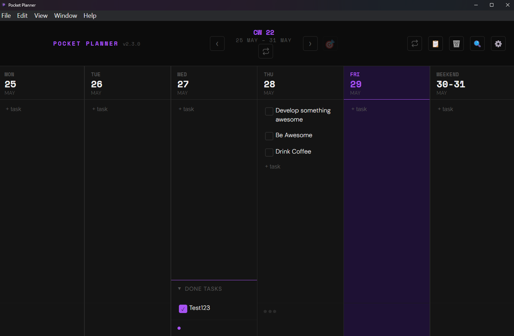
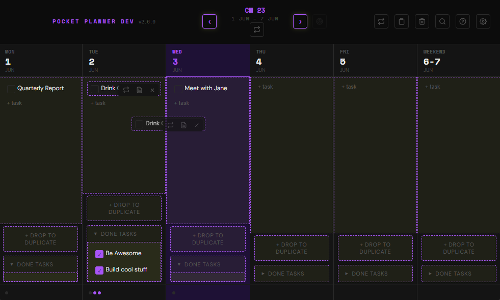
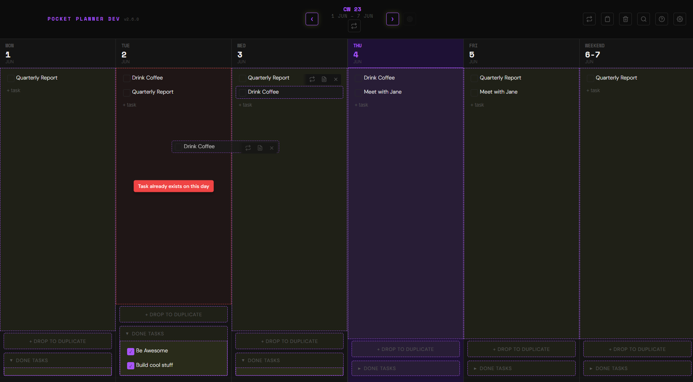
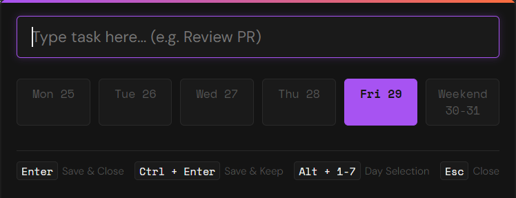
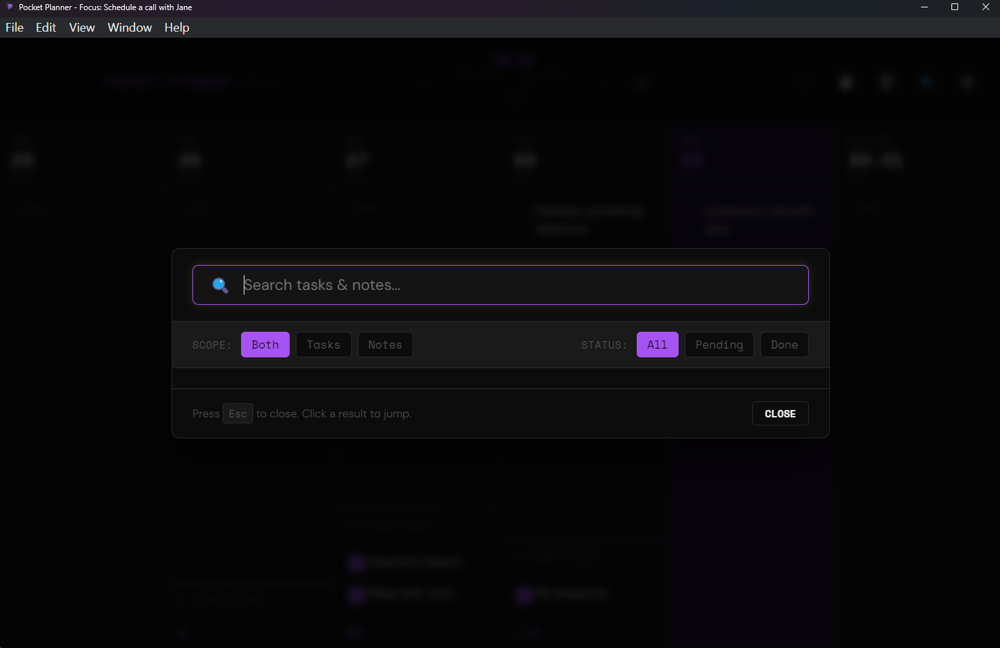
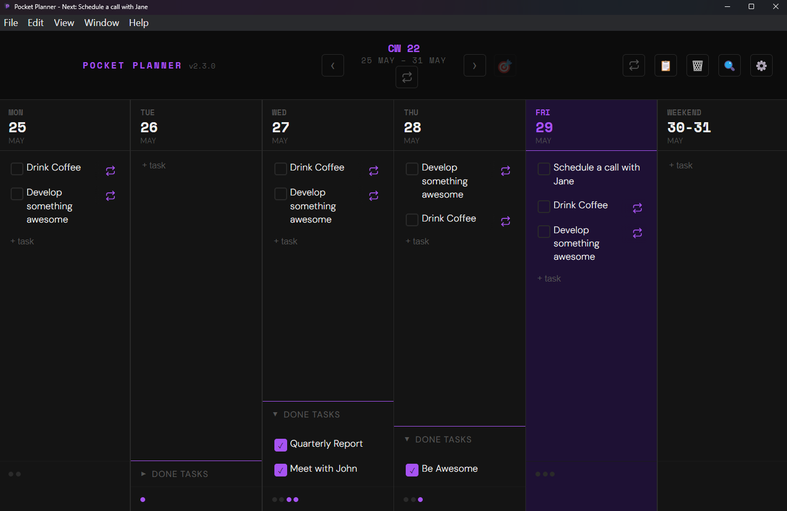
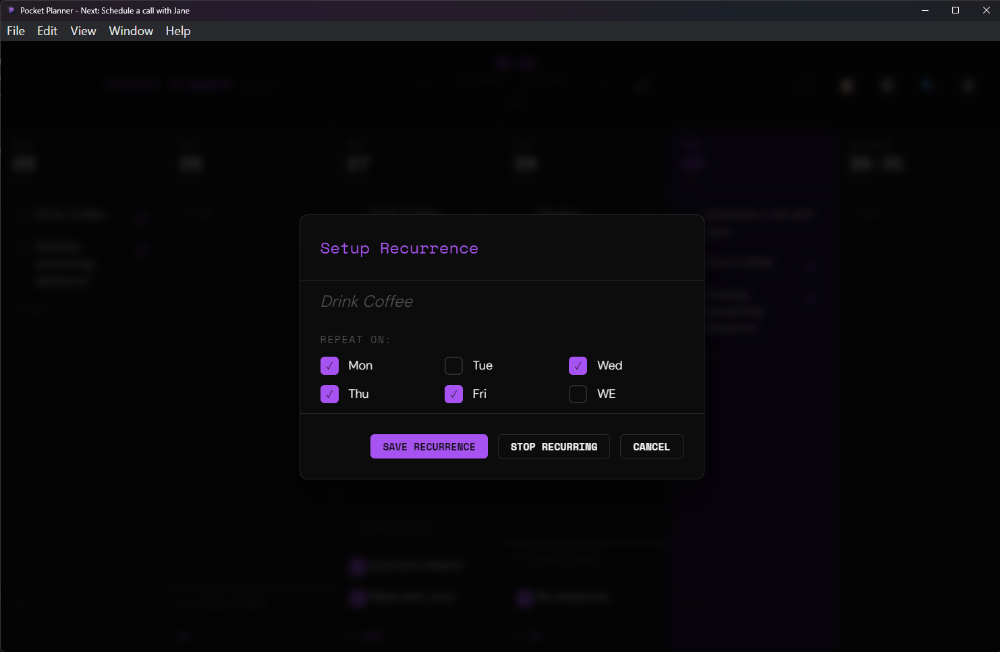
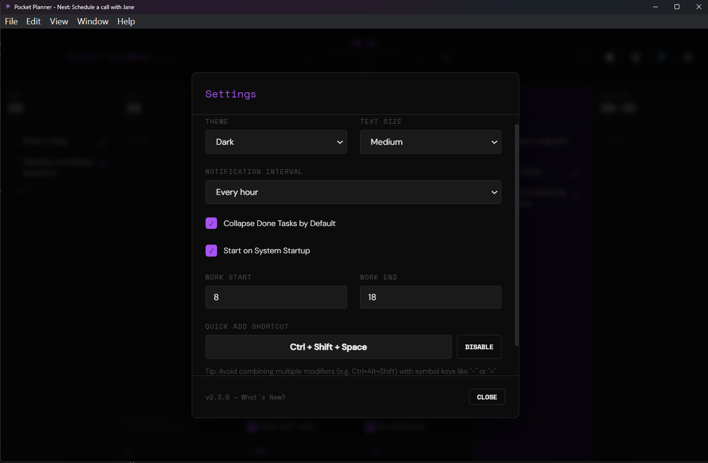
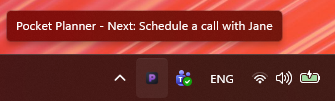

# 🗓️ Pocket Planner

A minimal, distraction-free desktop application for weekly task planning and daily execution.

Designed to keep you focused, Pocket Planner sits in your system tray and helps you structure your week, track your daily progress, and capture tasks instantly without cluttering your desktop.

---

## 📌 Table of Contents

- [🎨 Visual Preview](#visual-preview)
- [✨ Features](#features)
  - [Weekly Planning & Drag-and-Drop](#weekly-planning-and-drag-and-drop)
  - [Power Workflows](#power-workflows)
  - [Task Notes & Contextual Actions](#task-notes-and-contextual-actions)
  - [Deep OS Integration & Notifications](#deep-os-integration-and-notifications)
  - [Personalization](#personalization)
  - [Privacy-First & Local-Only](#privacy-first-and-local-only)
- [📸 Screenshots](#screenshots)
- [🚀 Download & Installation](#download-and-installation)
  - [macOS](#macos)
  - [Windows](#windows)
  - [Linux](#linux)
- [🛠️ Data Locations](#data-locations)

---

## <a id="visual-preview"></a>🎨 Visual Preview

> [!NOTE]
> _Screenshots below show Pocket Planner in action._


_Figure 1: The distraction-free weekly grid featuring task notes, progress tracking, and themes._

---

## <a id="features"></a>✨ Features

### <a id="weekly-planning-and-drag-and-drop"></a>📅 Weekly Planning & Drag-and-Drop

- **Intuitive Grid:** View and manage your entire work week at a glance.
- **Drag & Drop:** Easily reorder tasks within a day or drag them to reschedule for another day.
- **Task Duplication:** Drag a task over the "+ Drop to Duplicate" copy zone in any day column to clone it (cloned tasks start as active/undone and retain notes).
- **Incomplete Task Rollover:** Start every week fresh by carrying forward incomplete tasks from the previous week with a single click.

### <a id="power-workflows"></a>⚡ Power Workflows

- **Global Quick Add:** Use a global keyboard shortcut (configurable in settings) to instantly summon the Quick Add panel from anywhere in your OS. Add tasks on the fly without breaking your flow.
- **Recurring Tasks:** Define templates for daily or weekly tasks (e.g., stand-ups, status reports) and automatically sync them into your weekly schedule.
- **Deep Search:** Quickly search through all historical weeks, task descriptions, and detailed notes using the built-in search view.

### <a id="task-notes-and-contextual-actions"></a>📄 Task Notes & Contextual Actions

- **Rich Task Notes:** Hover over any task to add detailed notes, links, or checklists. Tasks with notes stay highlighted so you never lose context.
- **Any-Day Summaries:** Instantly generate a formatted text summary for any day to copy-paste into Slack, Teams, or email. Includes a comparison of "Today" vs "Yesterday" tasks.
- **Recycle Bin:** Accidentally deleted a task? Restore it instantly from the in-app Recycle Bin.

### <a id="deep-os-integration-and-notifications"></a>🔔 Deep OS Integration & Notifications

- **Workday-Aware Reminders:** Notifications respect your personal time and only fire during your configured working hours (e.g., 9:00 AM to 5:00 PM) at your preferred interval (30m, 1h, 2h, 4h).
- **Adaptive & Dynamic Messaging:** Reminders update based on the time of day (morning check-ins, afternoon focus nudges, evening wrap-ups) and automatically change to celebratory messages once all your tasks are completed.
- **Contextual Status:** Notifications explicitly show your first incomplete task ("Up Next") and your current progress (e.g., `3/5 tasks done`) to keep you on track.
- **Deep Linking:** Clicking any notification instantly opens and focuses the app to the relevant view.
- **Tray Utility:** The app lives quietly in your system tray (Windows) or Menu Bar (macOS). Hovering over the icon displays a tooltip showing your next task and progress.
- **Progress Metrics:**
  - **Windows:** The taskbar icon features a live progress bar reflecting your daily completion rate.
  - **macOS:** The Dock icon displays a red badge count of remaining tasks for the day.

### <a id="personalization"></a>🎨 Personalization

- **26 Built-In Themes:** Find your perfect vibe with dark and light themes including Nord, Dracula, Sunset, Cyberpunk, Forest, and standard system defaults.
- **Adjustable Typography:** Choose from small, medium, or large font scales to suit your display.

### <a id="privacy-first-and-local-only"></a>🔒 Privacy-First & Local-Only

- Your tasks belong to you. Pocket Planner stores all data locally on your computer via secure configuration files. There are no external servers, cloud databases, or accounts required.

---

## <a id="screenshots"></a>📸 Screenshots

| Feature                  | Preview                                                                      |
| ------------------------ | ---------------------------------------------------------------------------- |
| **Drag & Drop / Copy**   |                   |
| **Duplicate Prevention** |  |
| **Quick Add Overlay**    |                          |
| **Global Search**        |                          |
| **Recurring Tasks List** |                      |
| **Recurrence Setup**     |                    |
| **Settings & Themes**    |                          |
| **System Tray Utility**  |                        |

---

## <a id="download-and-installation"></a>🚀 Download & Installation

### <a id="macos"></a>🍏 macOS

#### Method 1: Via Homebrew (Recommended)

Install and keep Pocket Planner updated automatically:

```bash
# 1. Tap the repository
brew tap pocket-planner/tap

# 2. Install the app
brew install --cask pocket-planner
```

#### Method 2: Manual Installation

1.  Download the latest `.dmg` from the [Releases](https://github.com/pocket-planner/desktop-app-releases/releases) page.
2.  Open the downloaded `.dmg` and drag **Pocket Planner** to your **Applications** folder.

> [!IMPORTANT]
> **macOS Security Gatekeeper Workaround:**
> Since this app is self-signed, macOS Gatekeeper may block it or claim the app is "damaged" on first run. To authorize it, run the following command in Terminal:
>
> ```bash
> xattr -cr "/Applications/Pocket Planner.app"
> ```

---

### <a id="windows"></a>Windows

1.  Download the latest `.exe` installer from the [Releases](https://github.com/pocket-planner/desktop-app-releases/releases) page.
2.  Run the installer and follow the setup prompts.

> [!IMPORTANT]
> **Windows SmartScreen & Unblock Workaround:**
> Since this app is self-signed/unsigned, Windows Defender SmartScreen may display a protection warning on launch. To proceed:
>
> 1. **Bypass SmartScreen:** On the "Windows protected your PC" dialog, click **More info**, then click **Run anyway**.
> 2. **Manual File Unblock (if blocked from launching):**
>    - Right-click the downloaded `.exe` file and select **Properties**.
>    - In the _General_ tab, look for the **Security** section at the bottom.
>    - Check the **Unblock** checkbox and click **Apply** / **OK**.
>    - Launch the installer again.

---

### <a id="linux"></a>🐧 Linux

#### Method 1: Via Snap Store (Recommended)

[](https://snapcraft.io/pocket-planner)

```bash
sudo snap install pocket-planner
```

_Note: Updates are managed automatically by the snapd background service._

#### Method 2: Via AppImage

1.  Download the latest `.AppImage` from the [Releases](https://github.com/pocket-planner/desktop-app-releases/releases) page.
2.  Make it executable and run it:

```bash
chmod +x Pocket-Planner-*.AppImage
./Pocket-Planner-*.AppImage
```

#### Method 3: Via Debian/Ubuntu (.deb)

1.  Download the latest `.deb` package from the [Releases](https://github.com/pocket-planner/desktop-app-releases/releases) page.
2.  Install it using your system package manager:

```bash
sudo dpkg -i pocket-planner-*.deb
```

> [!NOTE]
> **Linux Integration Notes:**
>
> - **System Tray:** Linux tray icon integration depends on your Desktop Environment (DE). If you are running GNOME, you may need to install the **AppIndicator and KStatusNotifierItem Support** extension to view the system tray icon. KDE Plasma, XFCE, and MATE support the tray icon natively out of the box.
> - **Autostart:** The "Start on System Startup" setting creates a standard `.desktop` entry under `~/.config/autostart/`. This works out of the box in most desktop environments, but custom window managers (e.g., i3, Sway) may require manual autostart handling in their configuration files.

---

## <a id="data-locations"></a>🛠️ Data Locations

Your task plans and settings are saved locally at:

- **Windows:** `%APPDATA%\pocket-planner\config.json`
- **macOS:** `~/Library/Application Support/pocket-planner/config.json`
- **Linux (Snap):** `~/snap/pocket-planner/common/pocket-planner/config.json`
- **Linux (non-Snap):** `~/.config/pocket-planner/config.json`
